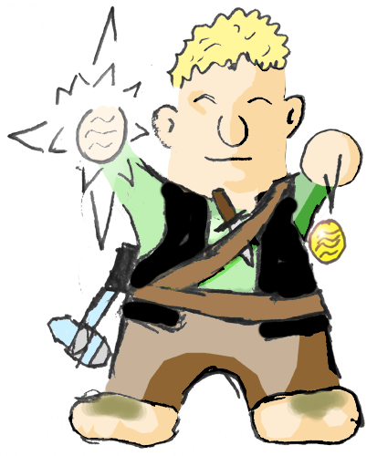

## Personality

Corrin takes nothing serious, and maintain a cheery outlook even in the grimmest situations. He is obsessive curious and often takes unnecessary risks, much to the irritation of his adventuring party.

## Birthplace

Town of Fallcrest in the Nentir Vale. Born into a rich family, Corrin soon found himself bored of the nobility. He wanted to make something of himself.

## Family

The Grey family is the only really noble halfling family in Fallcrest, with a close friendship with its governor, Faren Markelhay. The Gray's had a reputation for being down on earth despite their large fortune of money.

## Professions and Crafts

Most of the income the Grey-family have, they get from artistic metalworking. Corrin did also learn this craft, and one day he is supposed to continue his family's craft. But at the moment he is more interested in adventuring.

## Current situation

After nearly getting killed in the Shadowfell Keep, Corrin realized the frailty of life, and left his adventuring party to return home to Fallcrest to solve some unfinished issues with his family.
